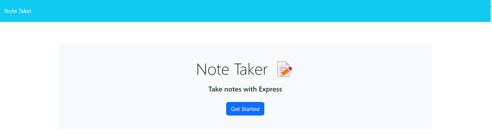
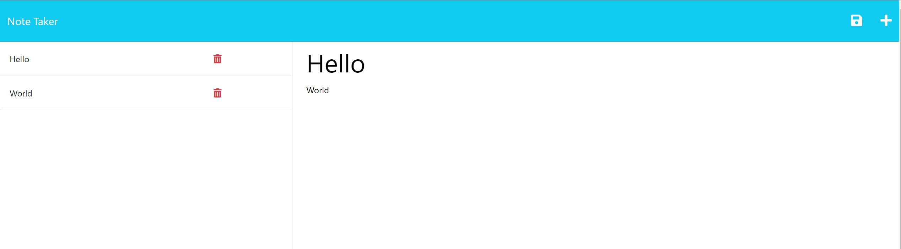

# Note Taker App


[Note Traker App](https://peaceful-spire-57918-098cf45fca12.herokuapp.com/)

[GitHub Repository](https://github.com/Fallen-Master/Note-Tracker)
    
## Description
This app allows you to save and display your notes. All saved notes appear on the left-hand side of the screen and can be deleted when they are no longer needed.
  
## Table of Contents
- [Preview](#Preview)
- [Installation](#installation)
- [License](#license)
- [Contributing Guidelines](#contributing-guidelines)
- [Questions](#questions)

## Preview


  
## Installation
Run the following command to install dependencies:
```
npm i
```
  
 ## License
This project is licensed under the MIT.
  
## Contributing Guidelines
N/A

  
## Questions 
If you have any questions about the repo, open an issue or contact me directly at [rgomez2014@gmail.com](mailto:rgomez2014@gmail.com). 
You can find more of my work at [Fallen-Master](https://github.com/Fallen-Master)
